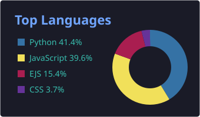

<!-- Animated header -->

<h1>
  Hello Fellow &lt; Developers/ &gt;!
  
</h1>

<!-- Typing animation -->

<ul>
  <li> Hi, I’m Viviana</li>
  <li> I'm a Software Engineer</li>
  <li> Turning ideas into full-stack code across web, mobile, and desktop.</li>
  <li> Dedicated to engineering seamless user experiences and rock-solid backend architectures.</li>
</ul>

## Skills 

  
  
  
  
  
  
  
  
  
  
  
  
  
  
  
  
  
  
  
  
  

## GitHub Stats 

  

  
  

<h3 align="center">Languages in my pinned projects</h3>

  
  
  
  

  

<!-- Animated footer -->

